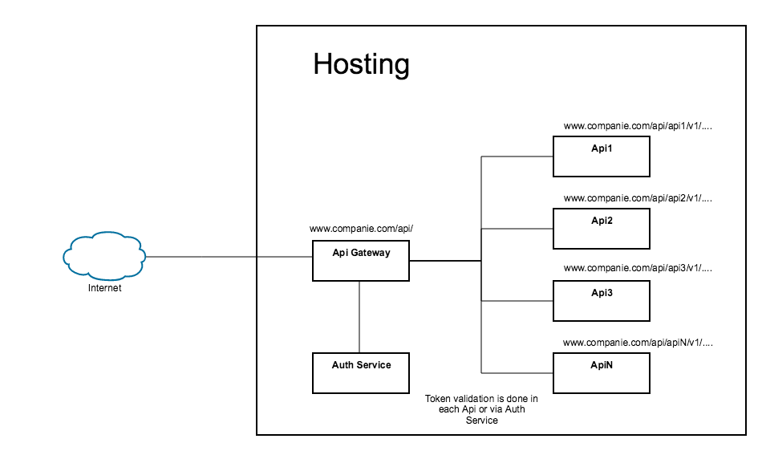
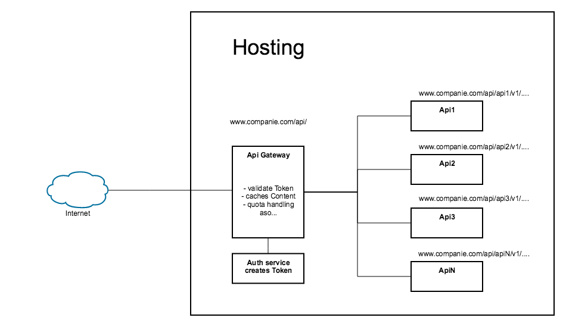

# Api Gateway

This document describes the evaluation of API Gateways within the Open Integration Hub.

## Why are Api Gateways necessary?

Some of the advantages of API gateways are:
* Have a unified public API so that client only have to manage few endpoints
* Manage authentication/authorization through API Gateway
* Caching and circuit breaker
* etc

## Types of API Gateway architecture

There are 2 different types of API Gateways. Generally speaking, in both cases the API Gateway functions as a proxy to other services.

### Type1: Simple API Gateway ###
Common usage: simply 1 Proxy for all API requests. A simple API Gateway only abstracts/masks the APIs behind it. This type of API Gateway can be implemented by nearly every proxy you could imagine (Apache, Nginx, Varnish ...)

**Pros**: 
* Easy to manage in a Kubernetes Cluster. An Ingress Controller could do that job
* Small footprint and easy to scale

**Cons**: 
* Additional features e.g. caching (CDN), authentication must be implemented in additional services

### Type2: Fat API Gateway ###

This gateway could do more than just proxy requests. For instance, it could support Authentication, Autorisation, WAF Functions, Caching. One could take existing proxy solutions and extend them with additional modules.
Exampels: Nginx Plus, Varnish, Kong, apiumbrella, Tyk

**Pros**: 
* A lot of features are already implemeted (Cache, Auth, Autor. , WAF)

**Cons**: 
* Most of the examples are not Open Source
* Higher complexity which requires Know how for management

## Link Collection

[Api Gateway done by Nginx](https://www.nginx.com/blog/building-microservices-using-an-api-gateway/)  
[Api Gatewas done by Kong](https://getkong.org/#comparison)  
[Api Gateway principles](http://microservices.io/patterns/apigateway.html)  
[Modern Authentication flows](https://nordicapis.com/how-to-control-user-identity-within-microservices/)  
[Kubernetes how too Authenticate](https://medium.com/jeroen-rosenberg/from-monolith-to-microservice-architecture-on-kubernetes-part-2-authentication-with-jwt-934ea030923)  

## Challenges

1. Depending on the security strategy of the cluster, one could either delegate the authentication to the API Gateway and making the communication within the cluster a trusted environment. Another option is to validate authentication on each request, e.g. having a central authentication service which can be asked at any given time if the request token is valid.

2. If a Fat API Gateway is used, should the features be part of the software, can 3rd party modules be used or should these be implemented by the team?
